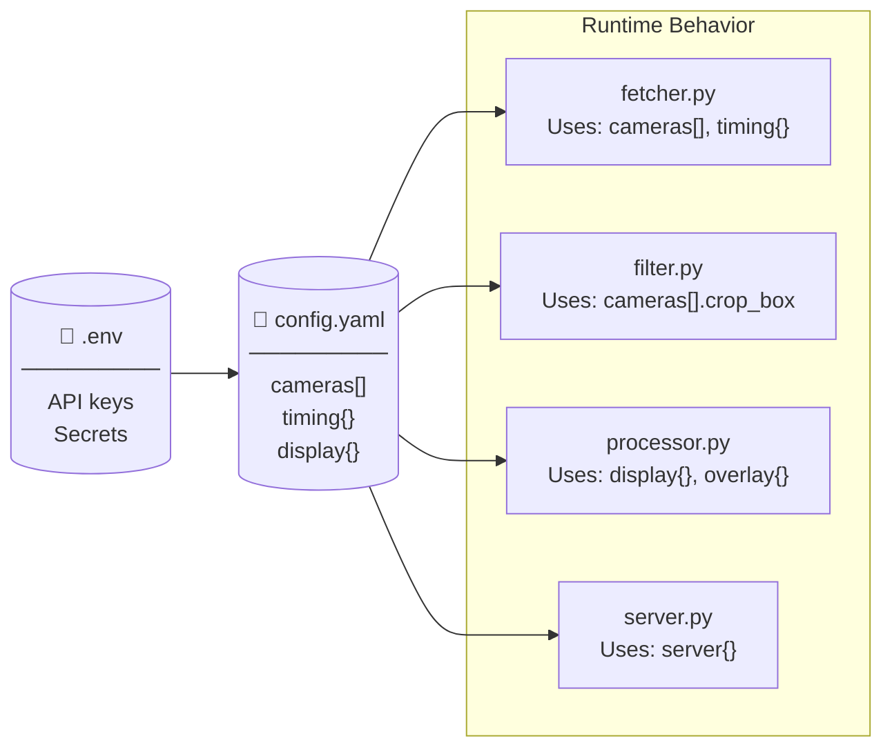
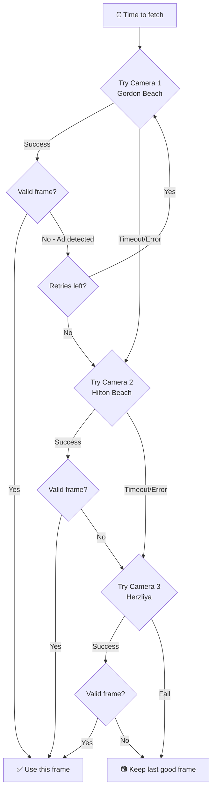
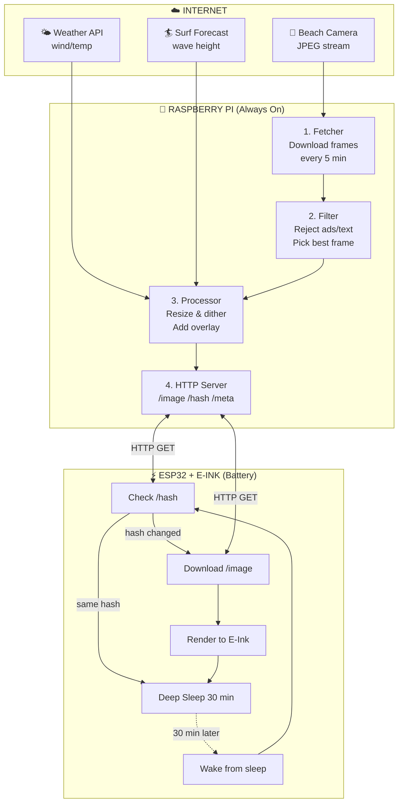
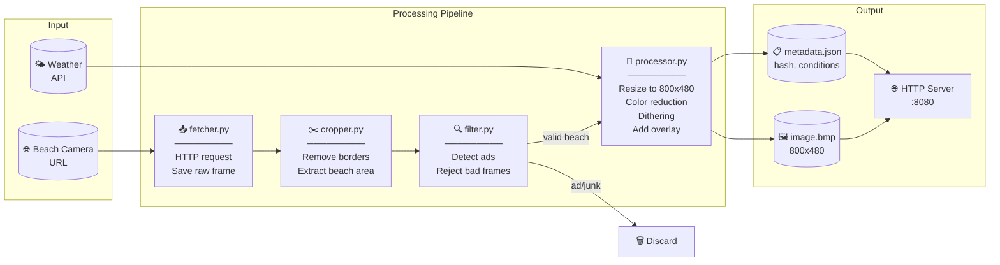
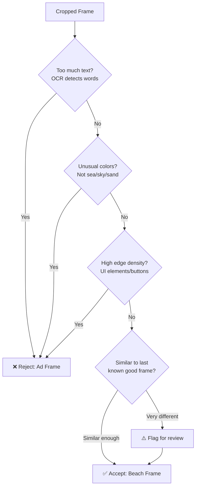
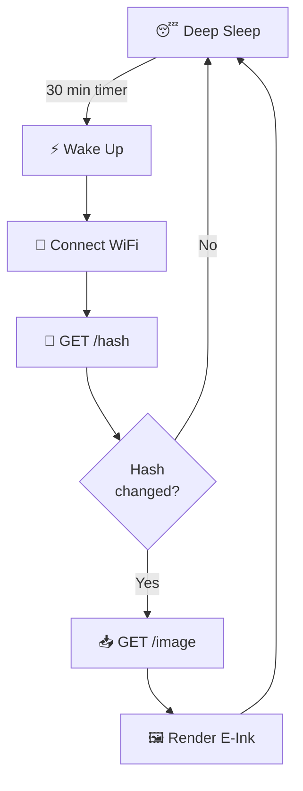
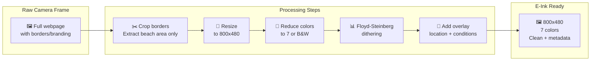
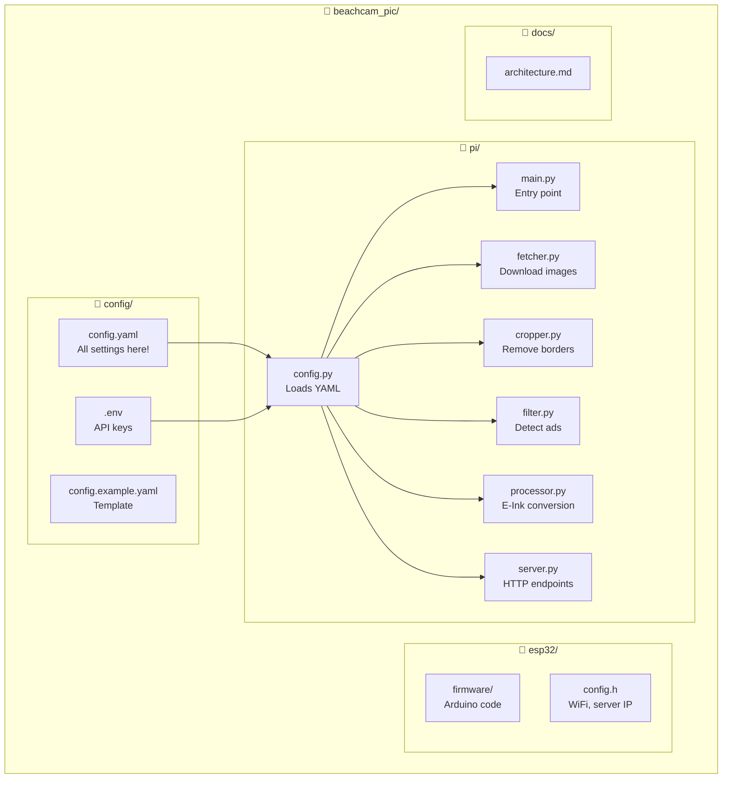
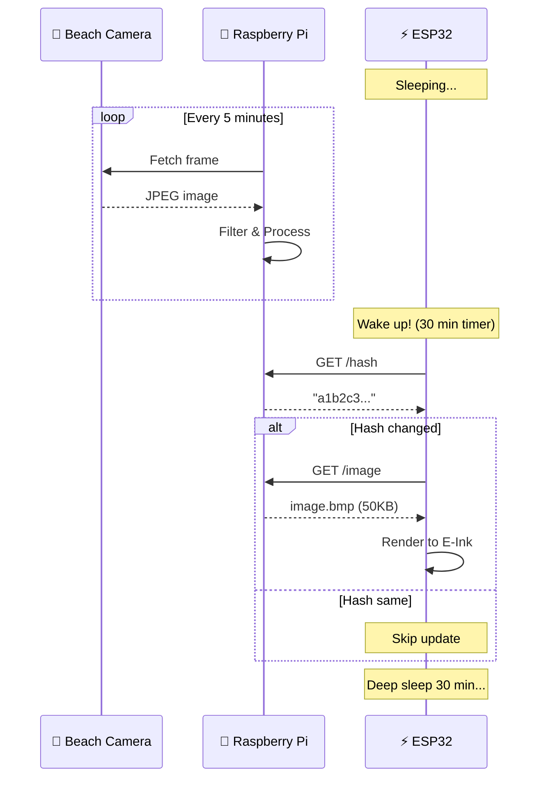

# Surf E-Ink Frame - System Architecture

## Configuration (config.yaml)

All settings are external - no code changes needed to switch cameras or adjust timing.

```yaml
# config.yaml - Easy to edit, no code changes needed

# ========== CAMERA SOURCES ==========
# Multiple cameras with fallback support
cameras:
  - name: "Tel Aviv - Gordon Beach"
    url: "https://example-cam.com/telaviv/snapshot.jpg"
    enabled: true
    crop_box: [120, 80, 1800, 980]  # left, top, right, bottom
    priority: 1  # Primary camera

  - name: "Tel Aviv - Hilton Beach"
    url: "https://backup-cam.com/hilton.jpg"
    enabled: true
    crop_box: [100, 50, 1820, 1000]
    priority: 2  # Fallback if primary fails

  - name: "Herzliya Beach"
    url: "https://another-cam.com/herzliya"
    enabled: false  # Disabled for now
    crop_box: [0, 0, 1920, 1080]
    priority: 3

# ========== TIMING ==========
timing:
  fetch_interval_minutes: 5      # How often Pi fetches new frames
  esp_sleep_minutes: 30          # How long ESP32 sleeps
  retry_on_fail_seconds: 60      # Retry delay if camera fails
  max_retries: 3                 # Give up after N failures

  # Daytime only operation
  active_hours:
    start: "06:00"
    end: "20:00"
    timezone: "Asia/Jerusalem"

# ========== DISPLAY ==========
display:
  width: 800
  height: 480
  colors: 7           # 7-color, or 2 for B&W
  dithering: true

# ========== OVERLAY ==========
overlay:
  enabled: true
  position: "bottom"  # bottom, top, corner
  show_location: true
  show_wave_height: true
  show_wind: true
  show_time: true

# ========== WEATHER API ==========
weather:
  provider: "openweathermap"  # or "windy", "surfline"
  api_key: "${WEATHER_API_KEY}"  # From environment variable
  location: "Tel Aviv, IL"

# ========== SERVER ==========
server:
  host: "0.0.0.0"
  port: 8080
```

## Configuration Flow



## Camera Fallback Logic



## Changing Cameras - Zero Code Changes

```bash
# Edit config, no Python changes needed
nano config.yaml

# Just restart the service
sudo systemctl restart beachcam

# Or if running manually
python main.py  # Automatically reloads config
```

## High-Level Overview



## Raspberry Pi - Data Flow



## Ad Detection Logic



### Frame Classification Examples

| Frame Type | Text? | Colors | Edges | Decision |
|------------|-------|--------|-------|----------|
| Clean beach | No | Blue/tan | Low | ✅ Accept |
| Ad overlay | "50% OFF" | Bright red/yellow | High | ❌ Reject |
| Loading screen | "Please wait" | Gray | Medium | ❌ Reject |
| Night/offline | "Camera offline" | Black | Low | ❌ Reject |
| Partial ad | Logo in corner | Normal | Medium | ⚠️ Maybe |

## ESP32 Wake Cycle



## Image Transformation



### What Gets Cropped

```
┌─────────────────────────────────────────────────────────┐
│  CAMERA SITE HEADER / LOGO / BRANDING                   │
├────────┬───────────────────────────────────┬────────────┤
│        │                                   │            │
│  ADS   │    ┌─────────────────────────┐    │   ADS /    │
│  OR    │    │                         │    │   MENU     │
│  MENU  │    │   🌊 ACTUAL BEACH 🌊    │    │            │
│        │    │      (we want this)     │    │            │
│        │    │                         │    │            │
│        │    └─────────────────────────┘    │            │
│        │         ↑ CROP THIS AREA ↑        │            │
├────────┴───────────────────────────────────┴────────────┤
│  FOOTER / SPONSOR LOGOS / TIMESTAMP                     │
└─────────────────────────────────────────────────────────┘

Config needed:
  crop_box = (left, top, right, bottom)  # pixel coordinates
```

## Project Structure



## Timing Sequence



## Component Summary

| Component | Runs | Input | Output |
|-----------|------|-------|--------|
| **fetcher.py** | Every 5 min | Beach camera URL | Raw JPEG frames |
| **filter.py** | After each fetch | Raw frames | Valid frames only |
| **processor.py** | When new valid frame | Valid frame + weather data | E-Ink optimized BMP |
| **server.py** | Always | HTTP requests | Image/hash/metadata |
| **ESP32** | Every 30 min | Wakes from sleep | Display update |
